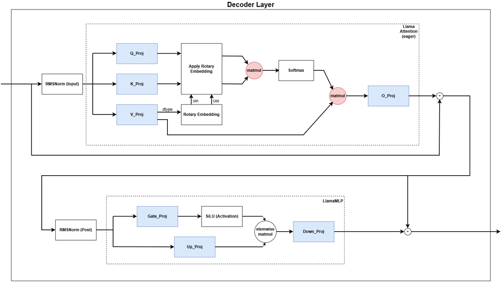
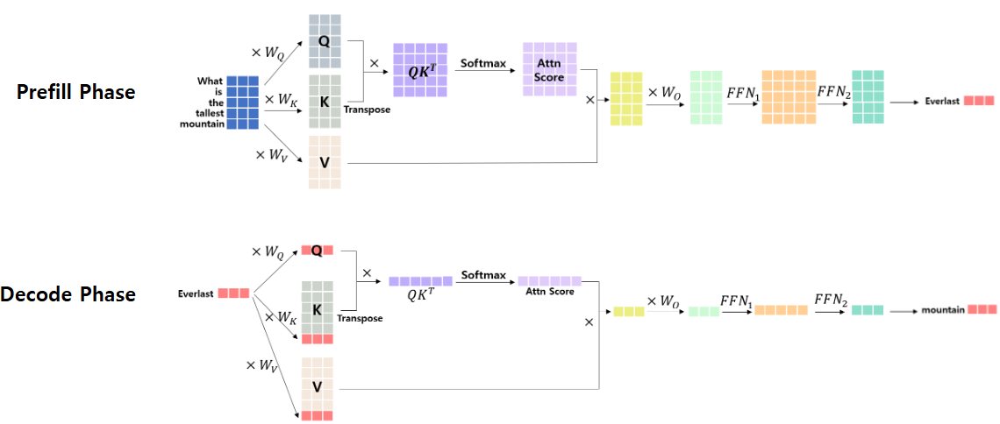

# LLM 추론 최적화 프로젝트
본 프로젝트는 **Llama 3.2 (1B/3B) 모델**을 기반으로, LLM 추론 성능을 결정짓는 핵심 병목(Compute-bound vs Memory-bound)을 분석하고 이를 해결하기 위한 Full-stack (Kernel-, System-Level) 최적화 기법을 단계적으로 적용해보는 것을 목표로 합니다.

## Optimization Techniques Overview
아래에 나열된 기법들은 본 프로젝트에서 이미 구현했거나, 추후 성능 향상을 위해 적용 목표로 삼고 있는 최적화 방법론들입니다
1. **Computation & Kernel Level (연산 가속 및 오버헤드 감소)**
- **Kernel Fusion (Operator Fusion)**: RMSNorm, Activation, Residual Add 등 연산량 자체보다 메모리 이동량이 병목이되는 연산들을 하나의 커널로 합쳐 Memory I/O를 줄입니다.
- **CUDA Graphs**: 반복되는 커널 실행 패턴을 하나의 그래프 단위로 묶어 CPU가 GPU에 커널을 실행하라고 명령하는 시간(Launch Overhead)를 줄입니다.
- **FlashAttention**: Attention 연산 시 행렬 전체를 HBM에 올리지 않고, SRAM에서의 Tiling 기법을 통해 메모리 접근을 최소화하여 속도를 크게 향상시킵니다.
- **Hand-tuend Kernels**: 현재 사용하는 하드웨어와 워크로드의 특징에 맞게 직접 튜닝하는 것도 최적화 기법이 될 수 있습니다.

2. **Memory & Precision Level (메모리 효율화)**
- **Weight-Only Quantization (INT4/INT8)**: 연산은 FP16으로 수행하되 모델 가중치만 low bit로 양자화하여 저장 및 이동에 활용하고 연산 직전에 Dequantize하여 메모리 I/O를 줄입니다.
- **KV Cache Quantization (FP8/INT8)**: Context가 길어질수록 기하급수적으로 커지는 KV Cache 데이터를 low bit로 양자화하여 메모리 사용량을 줄일 수 있씁니다.
- **Activation Quantization (W8A8)**: 가중치뿐만 아니라 Activation까지 INT8 정수로 양자화 후 연산 자체를 정수 연산 유닛(INT8 Tensor Core)에서 수행해 처리량을 높입니다.
- **Paged Attention (Memory Management)**: 운영체제의 가상 메모리 페이징 기법을 차용하여, KV Cache를 불연속적인 메모리 공간에 할당 가능하게해 메모리 단편화를 제거합니다. 더 자세한 내용은 [여기](https://github.com/jpyo0803/ml-systems-study/tree/main/vllm)에 정리해두었습니다.

3. **Algorithm & Serving Level (구조 및 스케줄링)**
- **Continuous Batching (In-flight Batching)**: 배치 내에서 먼저 완료된 요청은 즉시 내보내고 새로운 요청을 끼워 넣는 Iteration-level Scheduling을 사용해 GPU 활용율을 높입니다. 더 자세한 내용은 [여기](https://github.com/jpyo0803/ml-systems-study/tree/main/orca)에 정리해두었습니다.
- **Speculative Decoding**: 작은 모델(Drafter)이 토큰을 빠르게 speculative하게 예측하고, 큰 모델이 이를 검증하는 방식으로 생성 속도를 높입니다. 
- **Prefix Caching (Radix Attention)**: 여러 요청 간에 겹치는 시스템 프롬프트나 앞부분의 Context에 대한 KV Cache를 공유하여 중복 연산을 최소화 합니다.

## LLM 아키텍처 구조 분석
다음 다이어그램은 LLM variant 중에 하나인 Llama 모델의 단일 Decoder Layer를 보여줍니다. (다른 LLM variant도 비슷한 구조를 보입니다.)



Decoder Layer의 입력은 크게 다음 여섯 단계를 거쳐 생성된 출력을 다음 Decoder Layer로 전달합니다 (각 Decoder Layer은 동일한 과정을 반복함).

1. **RMSNorm (input)**: 레이어로 입력된 입력에 **Root Mean Square (RMS)** 정규화를 적용합니다. 
2. **Attention**: RMS Norm 출력에 Q, K, V Projection, RoPE, $Q\cdot K^{T}$, Softmax, $P\cdot V$, O Projection을 적용합니다.
3. **Residual Addition**: Attention 출력에 입력(RMSNorm 이전의 값)을 더하는 Residual Addition을 적용합니다.
4. **RMSNorm (post)**: Residual Addition 출력에 RMS 정규화를 적용합니다.
5. **MLP (SwiGLU)**: RMSNorm 출력을 두 갈래로 나누어 Gate Projection과 Up Projection을 수행하고, 두 결과를 Element-wise Product 한 뒤 Down Projection을 적용합니다.
6. **Residual Addition**: MLP 출력에 두번째 Residual Addition을 적용한 결과물을 다음 Decoder Layer에 전달합니다. 

## LLM 추론 과정 분석
LLM 추론 과정은 크게 **Prefill (프롬프트 전처리)** 단계와 **Decode (토큰 생성)** 단계로 나눌 수 있습니다. 다음 다이어그램에서는 **"What is the tallest mountain"** 이라는 입력이 주어졌을때 **"Everlast mountain"** 이라는 출력을 생성하기 까지 실제로 어떤 연산이 일어나는지 보여줍니다. 


### Prefill Phase
Prefill 단계는 사용자의 입력 프롬프트 전체를 처리하여 **첫 번째 토큰(Everlast)을 생성**하고, **Key-Value Cache 초기화** 과정을 진행합니다.

Prefill 과정에서 처리해야하는 토큰들은 같은 시점에 한꺼번에 주어지기 때문에 모든 토큰을 하나의 입력 행렬로 합쳐 Matrix-Matrix Multiplication (GEMM)이 가능합니다. (Batch 크기가 1인 경우 Token-level 합병이 가능)

만약 Batch 크기가 1보다 큰 경우에는 Projection 타입인 경우에 한해($Q\cdot K^{T}$와 $P\cdot V$ 연산은 각 Request에 대해 독립적으로 처리해야함) 해당 Batch에 포함되어있는 Request들을 더 큰 단일 행렬로 합친 후 행렬 곱셈이 가능합니다. (Request-level 합병)

일반적으로 Token-, Request- level 순서로 합병이 가능할수록 GEMM은 더 높은 연산 밀도(Arithmetic Intensity)로 행렬 곱셈이 가능합니다.

결과적으로 Prefill 단계가 완료되면 첫번째 토큰(Everlast)이 생성이되고 Decode 단계로 넘어가게 됩니다.

### Decode Phase
Decode 단계에서는 첫 번째 토큰(Everlast) 생성 이후, 종료 토큰(EOS)이 나올 때까지 이전 시점의 정보(Key-Value Cache)를 바탕으로 다음 단어를 하나씩 예측하는 단계입니다 (Auto-regressive Generation). 

Decode 단계에서 매 iteration마다 생성되는 토큰은 KV Cache에 순서대로 쌓이며 이전 시점의 정보로 활용됩니다. KV Cache는 상황에 따라서 재계산 또는 유지가 가능합니다만 일반적으로 메모리를 희생해서 재계산을 하지 않는 방식이 주로 사용됩니다. 위 다이어그램의 Decode Phase에서 분홍색 토큰은 해당 iteration에서 새롭게 생성된 토큰이며 기존에 존재하던 KV Cache에 Concatenate되고 다음 연산을 이어나갑니다.

Decode 단계의 중심이 되는 연산은 Matrix-Vector Multiplication (GEMV)입니다 (Batch Size가 클 경우 작은 GEMM 형태를 띠지만 여전히 Memory Bound 특성을 보입니다). GEMV는 연산 밀도가 낮은 연산으로 분류되어 일반적으로 연산량 대비 메모리 이동량이 압도하는 특징을 보입니다 (메모리 이동량 > 연산량).

따라서 GEMV 연산의 경우 Host-Device간 메모리 이동량을 줄이는 기법인 **Weight Quantization**이나 **Kernel Fusion**을 통해 메모리 I/O를 줄이는 것이 최적화에 도움이 될 수 있습니다.

## 실행 방법
```sh
$ cd docker && docker compose up
```